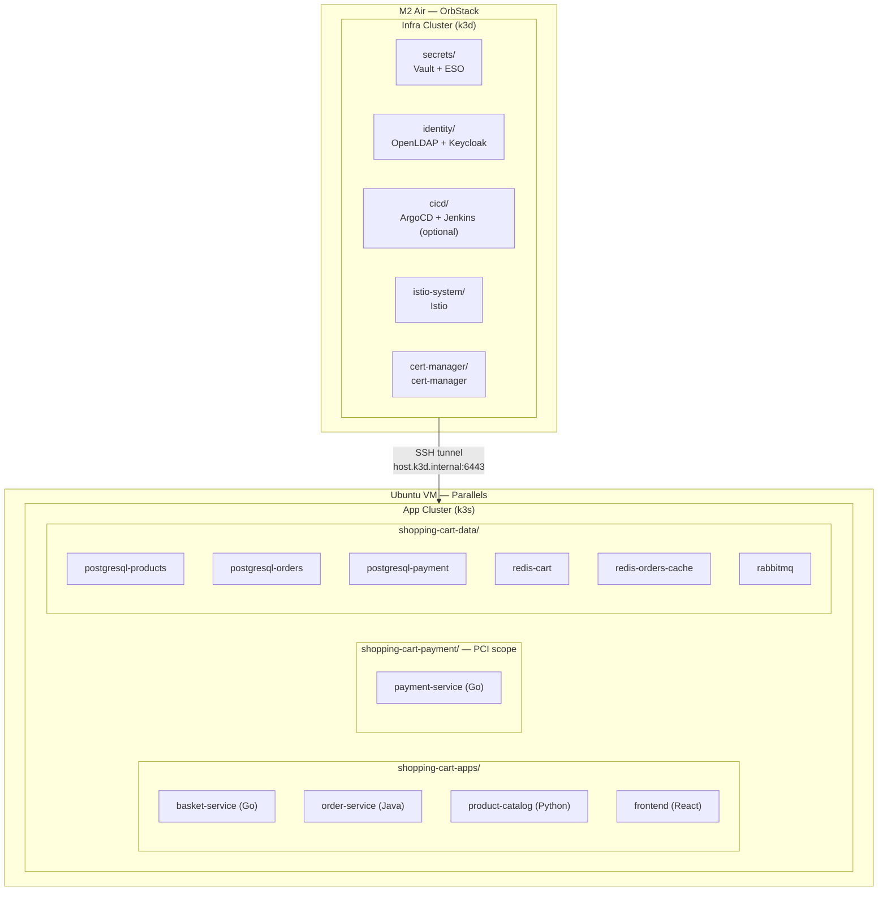
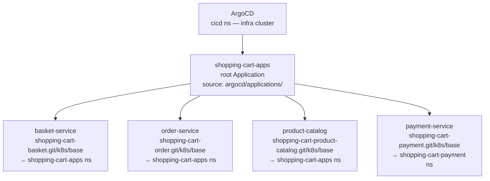
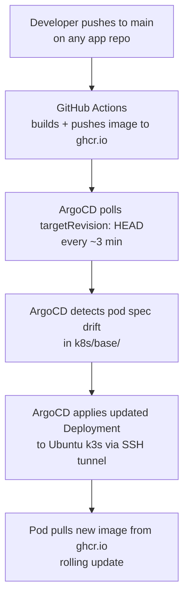
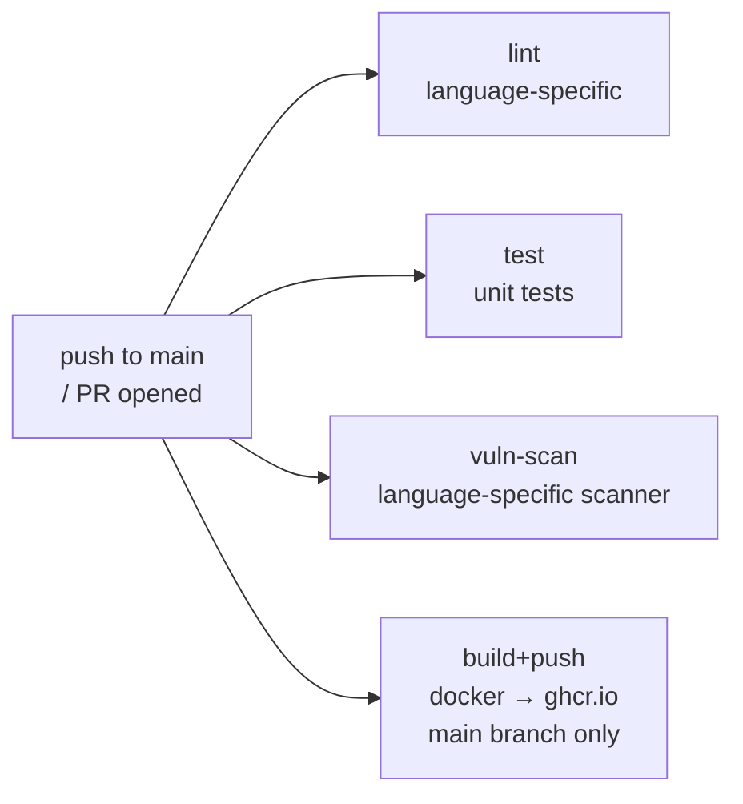
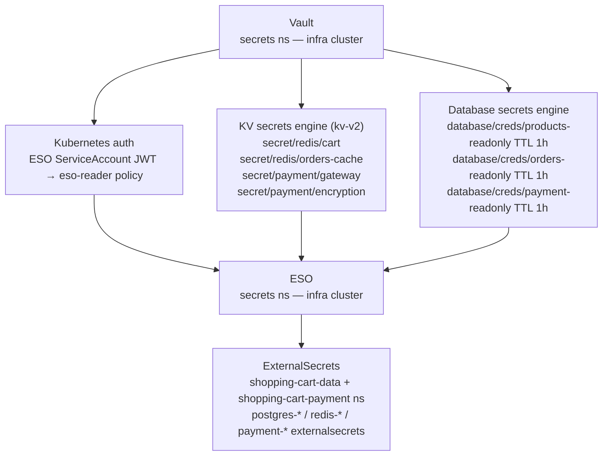
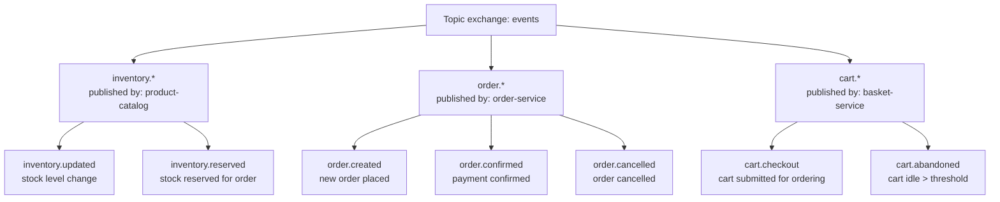

# Shopping Cart — System Architecture

**Last Updated:** 2026-03-17
**Status:** Living document — update when infrastructure changes

---

## Table of Contents

1. [System Overview](#1-system-overview)
2. [Two-Cluster Infrastructure Layout](#2-two-cluster-infrastructure-layout)
3. [GitOps / CD — ArgoCD](#3-gitops--cd--argocd)
4. [CI Pipeline — GitHub Actions](#4-ci-pipeline--github-actions)
5. [Secret Management — Vault + ESO](#5-secret-management--vault--eso)
6. [Identity & Access — OpenLDAP + Keycloak](#6-identity--access--openldap--keycloak)
7. [Message Queue — RabbitMQ](#7-message-queue--rabbitmq)
8. [Data Layer](#8-data-layer)
9. [Observability — Prometheus + Grafana (planned)](#9-observability--prometheus--grafana-planned)

---

## 1. System Overview

The shopping cart platform is a GitOps-driven microservices system running across two Kubernetes clusters. The infra cluster hosts platform services (secrets, identity, CI/CD). The app cluster hosts the application workloads.



**Design principles:**
- Git is the single source of truth for all deployed state
- No credentials in git — all secrets flow through Vault + ESO
- Each microservice owns its own database (no shared schemas)
- Payment service runs in an isolated namespace simulating PCI DSS scope separation

**Related operational docs:**
- [Vault Usage Guide](vault-usage-guide.md)
- [RabbitMQ Operations](rabbitmq-operations.md)
- [Redis Password Rotation](redis-password-rotation.md)
- [Vault Password Rotation](vault-password-rotation.md)

---

## 2. Two-Cluster Infrastructure Layout

### Why two clusters

The infra cluster provides shared platform services that multiple environments could consume. The app cluster is the deployment target — isolated so platform failures do not directly impact the app layer, and the app cluster can be rebuilt without touching Vault, ArgoCD, or LDAP.

### Infra cluster — k3d on OrbStack

| Namespace | Components | Purpose |
|---|---|---|
| `secrets` | Vault, ESO | Root of trust for all credentials; ESO syncs secrets to app cluster |
| `identity` | OpenLDAP, Keycloak | Directory service + OIDC federation for ArgoCD SSO |
| `cicd` | ArgoCD, Jenkins* | GitOps controller; Jenkins optional (`ENABLE_JENKINS=1`) |
| `istio-system` | Istio | Service mesh — hardcoded namespace |
| `cert-manager` | cert-manager | TLS certificate lifecycle |

*Jenkins is gated behind `ENABLE_JENKINS=1` — omit to save ~512MB RAM on the infra cluster.

### App cluster — k3s on Ubuntu (Parallels VM)

| Namespace | Components | Notes |
|---|---|---|
| `shopping-cart-apps` | basket, order, product-catalog, frontend | Main application workloads |
| `shopping-cart-payment` | payment-service | PCI-scope simulated isolation (`pci-scope: true`) |
| `shopping-cart-data` | PostgreSQL ×3, Redis ×2, RabbitMQ | All stateful data layer |

### Cluster connectivity — SSH tunnel

ArgoCD pods inside the infra k3d network cannot reach the Ubuntu VM API server directly. The M2 Air host forwards the k3s API port:

```bash
ssh -fNL 0.0.0.0:6443:localhost:6443 ubuntu
```

This makes `https://host.k3d.internal:6443` reachable from inside k3d. ArgoCD uses this as the cluster endpoint. `insecureSkipVerify: true` is set in the cluster secret because k3s TLS certificates are issued for `127.0.0.1`, not the hostname.

The cluster secret is registered via `scripts/register-ubuntu-k3s.sh` — credentials are never committed to git.

---

## 3. GitOps / CD — ArgoCD

### Directory structure

```
argocd/
├── applications/
│   ├── shopping-cart-apps.yaml   # root Application (app-of-apps)
│   ├── basket-service.yaml       # child Application
│   ├── order-service.yaml        # child Application
│   ├── payment-service.yaml      # child Application
│   └── product-catalog.yaml      # child Application
├── config/
│   ├── argocd-cm.yaml            # OIDC / Keycloak SSO config
│   ├── argocd-rbac-cm.yaml       # RBAC role bindings
│   ├── argocd-secret.yaml        # server secret (admin password hash)
│   └── shopping-cart.yaml        # cluster registration secret
└── projects/
    └── shopping-cart.yaml        # AppProject — source/destination permissions
```

### App-of-Apps vs ApplicationSet

We use **app-of-apps** (a root `Application` that watches `argocd/applications/`) rather than `ApplicationSet` for the following reasons:

| Concern | App-of-Apps | ApplicationSet |
|---|---|---|
| Per-service namespace | Each child sets its own `destination.namespace` | Requires generator templating |
| Per-service Kustomize patches | Defined inline per child manifest | Complex with matrix generators |
| Adding a new service | Drop a new YAML in `argocd/applications/` | Same, but template logic is shared |
| Complexity for 4–6 services | Low | Higher (generator config, template variables) |

ApplicationSet is the right choice when you have many services with identical structure (10+) or need cluster-level fan-out. For this platform ApplicationSet would add overhead without benefit.

### App-of-Apps pattern

All shopping cart deployments are managed through a two-level ArgoCD hierarchy:



The root Application (`shopping-cart-apps`) watches the `argocd/applications/` directory in this repo and creates or deletes child Applications automatically when manifests are added or removed.

### AppProject

`argocd/projects/shopping-cart.yaml` defines the `shopping-cart` AppProject. It is intentionally permissive (any source repo, any destination) for this local dev environment:

```yaml
spec:
  sourceRepos:
    - '*'
  destinations:
    - namespace: '*'
      server: '*'
  clusterResourceWhitelist:
    - group: '*'
      kind: '*'
```

Scope this down for a shared or production cluster — restrict `sourceRepos` to your org and `destinations` to known namespaces.

### How image updates flow



No image tag update step is required. ArgoCD tracks `HEAD` on each app repo directly. There is no intermediate Helm values file or yq commit step.

### Kustomize patches (per child Application)

Each Application injects two patches without touching the source repo:

**1. Replica cap** — stays within the Ubuntu VM's 2-core constraint:

```yaml
kustomize:
  patches:
    - patch: |-
        - op: replace
          path: /spec/replicas
          value: 1
      target:
        kind: Deployment
```

**2. Image pull secret** — injects `ghcr-pull-secret` for private ghcr.io images:

```yaml
    - patch: |-
        - op: add
          path: /spec/template/spec/imagePullSecrets
          value:
            - name: ghcr-pull-secret
      target:
        kind: Deployment
```

`ignoreDifferences` on `/spec/replicas` prevents ArgoCD from reverting HPA-managed replica counts if an HPA is introduced later.

### Sync policy

All child Applications use:

```yaml
syncPolicy:
  automated:
    prune: true       # removes resources deleted from git
    selfHeal: true    # reverts manual kubectl changes
    allowEmpty: false
  retry:
    limit: 5
    backoff: 5s → 3m  # exponential, capped at 3 minutes
```

### Adding a new service

1. Add a new `Application` manifest to `argocd/applications/<service-name>.yaml`
2. Set `spec.source.repoURL` to the service repo, `path: k8s/base`
3. Set `spec.destination.server: https://host.k3d.internal:6443`
4. Add the replica cap and `ghcr-pull-secret` patches (copy from an existing child)
5. Commit — the root Application picks it up on next sync (~3 min)

---

## 4. CI Pipeline — GitHub Actions

Each application repository has its own CI workflow triggered on push to `main` and on pull requests.

### Standard pipeline stages



| Service | Language | Vuln scanner |
|---|---|---|
| basket-service | Go | `govulncheck` |
| order-service | Java | OWASP Dependency-Check |
| payment-service | Go | `govulncheck` |
| product-catalog | Python | `pip-audit` |
| frontend | React/Node | `npm audit` |

### Image registry

All images push to `ghcr.io/wilddog64/<service-name>:<sha>`. ArgoCD pulls from there when syncing to the app cluster. No intermediate registry or image promotion step.

### What CI does not do

- Does not update image tags in this repo (no Helm values file, no yq commit step)
- Does not trigger ArgoCD directly — ArgoCD polls on its own schedule
- Does not deploy to staging or production — single environment for this demo

---

## 5. Secret Management — Vault + ESO

### Architecture



### Cross-cluster auth

ESO on the infra cluster authenticates to Vault using a Kubernetes ServiceAccount JWT. Over the SSH tunnel, Vault's Kubernetes auth CA validation fails — the fallback is a static Vault token with `eso-reader` policy scope. This is a known limitation of the tunnel architecture.

### Deploy keys

ArgoCD uses SSH deploy keys to pull from private GitHub repos. Keys are stored in Vault and synced to ArgoCD via ESO. Rotation policy (v0.8.0 — pending implementation):
- Scheduled: every 24 hours
- Triggered: on every merge to `shopping-cart-infra` main

---

## 6. Identity & Access — OpenLDAP + Keycloak

### Components

| Component | Namespace | Role |
|---|---|---|
| OpenLDAP | `identity` (infra cluster) | Directory service — user/group storage |
| Keycloak | `identity` (infra cluster) | OIDC provider — federates LDAP identities |

### ArgoCD SSO

ArgoCD uses Keycloak as its OIDC provider directly (Dex is disabled). Configuration in `argocd/config/argocd-cm.yaml`:

- OIDC issuer: `http://keycloak.identity.svc.cluster.local/realms/shopping-cart`
- Keycloak `groups` claim mapped to ArgoCD RBAC roles via `argocd-rbac-cm.yaml`
- Admin access: `argocd-admins` group in Keycloak → `role:admin` in ArgoCD

### User population

OpenLDAP is seeded with dev users (alice, bob, etc.) in the `shopping-cart` org unit. Keycloak federates this via LDAP user federation. Jenkins (when enabled) also authenticates against OpenLDAP.

---

## 7. Message Queue — RabbitMQ

### Deployment

RabbitMQ runs as a 3-replica StatefulSet in `shopping-cart-data` on the app cluster. Peer discovery uses the Kubernetes plugin (`rabbitmq_peer_discovery_k8s`).

Enabled plugins: `rabbitmq_management`, `rabbitmq_peer_discovery_k8s`, `rabbitmq_prometheus`

### Exchange design



### Publisher / consumer map

| Service | Publishes | Consumes |
|---|---|---|
| basket-service | `cart.*` | — |
| order-service | `order.*` | `cart.checkout`, `inventory.reserved` |
| payment-service | — | `order.created` |
| product-catalog | `inventory.*` | `order.confirmed`, `order.cancelled` |

For full message schemas and payload definitions see [Message Schemas](message-schemas.md).

### Observability hook

`rabbitmq_prometheus` plugin is enabled — Prometheus metrics are exposed at `:15692/metrics`. A ServiceMonitor spec is documented in [docs/issues/002-rabbitmq-prometheus-plugin.md](issues/002-rabbitmq-prometheus-plugin.md) ready for use once the observability stack is deployed.

---

## 8. Data Layer

All stateful infrastructure runs in the `shopping-cart-data` namespace on the app cluster, except PostgreSQL for payment which is in `shopping-cart-payment` (PCI-scope isolation).

### PostgreSQL — per-service pattern

Each service owns its own PostgreSQL instance. No shared schemas, no cross-service queries.

| Instance | Namespace | Consumer |
|---|---|---|
| `postgresql-products` | `shopping-cart-data` | product-catalog |
| `postgresql-orders` | `shopping-cart-data` | order-service |
| `postgresql-payment` | `shopping-cart-payment` | payment-service |

Credentials are dynamically generated by Vault's database secrets engine (TTL 1h, max 24h). ESO refreshes the Kubernetes Secret before expiry.

### Redis

| Instance | Namespace | Purpose |
|---|---|---|
| `redis-cart` | `shopping-cart-data` | Basket session storage (basket-service) |
| `redis-orders-cache` | `shopping-cart-data` | Order read cache (order-service) |

Passwords are static secrets stored in Vault KV and synced via ESO.

### RabbitMQ

Single 3-replica cluster in `shopping-cart-data`. Shared by all services. See [Section 7](#7-message-queue--rabbitmq).

### Namespace summary

```
shopping-cart-data (app cluster)
  postgresql-products    StatefulSet
  postgresql-orders      StatefulSet
  redis-cart             StatefulSet
  redis-orders-cache     StatefulSet
  rabbitmq               StatefulSet (3 replicas)

shopping-cart-payment (app cluster — PCI scope)
  postgresql-payment     StatefulSet
  payment-service        Deployment
```

---

## 9. Observability — Prometheus + Grafana (planned)

**Status: planned — no manifests deployed yet**

### Intended scope

| Component | Target namespace | What it monitors |
|---|---|---|
| Prometheus | `monitoring` (app cluster) | All namespaces via ServiceMonitors |
| Grafana | `monitoring` (app cluster) | Dashboards for app + data layer metrics |

### Ready now

- `rabbitmq_prometheus` plugin is already enabled — metrics available at `:15692/metrics` on RabbitMQ pods as soon as a Prometheus instance is deployed
- ServiceMonitor spec for RabbitMQ documented in [docs/issues/002-rabbitmq-prometheus-plugin.md](issues/002-rabbitmq-prometheus-plugin.md)

### Planned ServiceMonitors

- RabbitMQ (queue depth, consumer count, memory)
- PostgreSQL (via postgres-exporter sidecar)
- Redis (via redis-exporter sidecar)
- Application services (HTTP request rates, error rates via Istio)

### Implementation path

1. Deploy `kube-prometheus-stack` Helm chart into `monitoring` namespace on app cluster
2. Apply RabbitMQ ServiceMonitor from issue 002
3. Add exporter sidecars to PostgreSQL and Redis StatefulSets
4. Import dashboards for each data layer component
