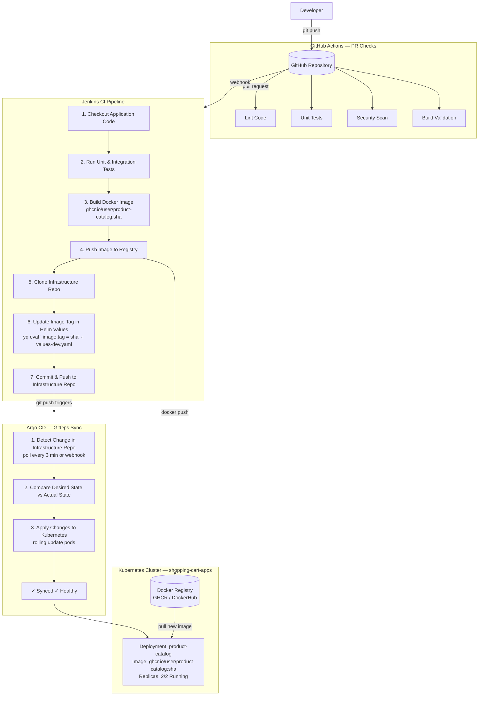

# CI/CD Architecture - GitHub + Jenkins + Argo CD

**Last Updated:** 2026-03-25
**Version:** 1.0
**Architecture:** GitOps with Multi-Repository Strategy

## Table of Contents

- [Overview](#overview)
- [Architecture Diagram](#architecture-diagram)
- [Repository Strategy](#repository-strategy)
- [CI/CD Flow](#cicd-flow)
- [GitHub Integration](#github-integration)
- [Jenkins Pipeline](#jenkins-pipeline)
- [Argo CD Deployment](#argo-cd-deployment)
- [GitHub Actions Integration](#github-actions-integration)
- [Complete Setup Guide](#complete-setup-guide)
- [Deployment Scenarios](#deployment-scenarios)
- [Monitoring and Observability](#monitoring-and-observability)

---

## Overview

This architecture implements a complete GitOps CI/CD pipeline using:

- **GitHub** - Source code management and webhook triggers
- **GitHub Actions** - PR validation, testing, and quality checks
- **Jenkins** - Continuous Integration (build, test, push images)
- **Docker Registry** - Container image storage (GHCR or DockerHub)
- **Argo CD** - Continuous Deployment (GitOps sync to Kubernetes)
- **Kubernetes** - Target deployment platform (k3d/k3s)

**Key Principle:** Git is the single source of truth for both application code and infrastructure configuration.

---

## Architecture Diagram



---

## Repository Strategy

### Multi-Repository GitOps Model

**Total Repositories: 5**

#### Application Repositories (4 repos - CI domain)

Each microservice has its own repository:

1. **shopping-cart-product-catalog** (Python + Flask)
2. **shopping-cart-cart** (Go + Gin)
3. **shopping-cart-order** (Java + Spring Boot)
4. **shopping-cart-frontend** (React + Nginx)

**Contents:**
- Application source code
- Unit tests
- Dockerfile
- Jenkinsfile (CI pipeline)
- .github/workflows/ (GitHub Actions for PR checks)

**CI/CD Responsibility:**
- GitHub Actions: PR validation (lint, test, security scan)
- Jenkins: Build images, push to registry, update infrastructure repo

#### Infrastructure Repository (1 repo - CD domain)

**shopping-cart-infrastructure** (this repo)

**Contents:**
- Kubernetes manifests (PostgreSQL, Redis)
- Helm charts (application services)
- Argo CD Applications
- Deployment configuration

**CD Responsibility:**
- Argo CD: Deploy infrastructure and applications to Kubernetes

---

## CI/CD Flow

### Complete Flow (Product Catalog Example)

```bash
# STEP 1: Developer workflow
cd shopping-cart-product-catalog
git checkout -b feature/add-search
# ... make changes to app/routes.py ...
git add .
git commit -m "feat: add product search endpoint"
git push origin feature/add-search

# STEP 2: GitHub Actions runs (on PR)
# - Lint Python code (flake8, black)
# - Run unit tests (pytest)
# - Security scan (bandit, safety)
# - Code coverage report

# STEP 3: Merge to main
git checkout main
git merge feature/add-search
git push origin main

# STEP 4: GitHub webhook triggers Jenkins
# Jenkins receives push event for product-catalog repo

# STEP 5: Jenkins CI Pipeline executes
# Stage 1: Checkout code from product-catalog repo
# Stage 2: Run tests (pytest --cov)
# Stage 3: Build Docker image
#   IMAGE_TAG=$(git rev-parse --short HEAD)  # abc123
#   docker build -t ghcr.io/user/product-catalog:$IMAGE_TAG
# Stage 4: Push to registry
#   docker push ghcr.io/user/product-catalog:abc123
# Stage 5: Clone infrastructure repo
#   git clone git@github.com:user/shopping-cart-infrastructure
# Stage 6: Update Helm values
#   yq eval ".productCatalog.image.tag = 'abc123'" \
#     -i chart/values-dev.yaml
# Stage 7: Commit and push
#   git commit -m "chore: update product-catalog to abc123"
#   git push origin main

# STEP 6: Argo CD detects change (3-minute poll or webhook)
# Compares: Git state vs Cluster state
# Detects: productCatalog.image.tag changed

# STEP 7: Argo CD syncs application
argocd app sync shopping-cart-dev
# - Pulls new image: ghcr.io/user/product-catalog:abc123
# - Updates deployment
# - Performs rolling update (old pods → new pods)
# - Waits for health checks to pass

# STEP 8: Verify deployment
kubectl get pods -n shopping-cart-apps
# product-catalog-7d8f4b5c9-abcde   1/1   Running   0   30s (NEW)
# product-catalog-7d8f4b5c9-fghij   1/1   Running   0   25s (NEW)

# Application is now live with new search feature!
```

---

## GitHub Integration

### 1. Repository Setup

For each application repository:

```bash
# Create GitHub repository
gh repo create shopping-cart-product-catalog --public

# Clone and initialize
git clone git@github.com:user/shopping-cart-product-catalog.git
cd shopping-cart-product-catalog

# Add code structure
mkdir -p app tests .github/workflows
touch Dockerfile Jenkinsfile requirements.txt
```

### 2. GitHub Actions Workflow (PR Checks)

**File:** `.github/workflows/ci.yml`

```yaml
name: CI - Pull Request Checks

on:
  pull_request:
    branches: [main, develop]
  push:
    branches: [main]

jobs:
  lint:
    runs-on: ubuntu-latest
    steps:
      - uses: actions/checkout@v4

      - name: Set up Python
        uses: actions/setup-python@v4
        with:
          python-version: '3.11'

      - name: Install dependencies
        run: |
          pip install flake8 black pylint
          pip install -r requirements.txt

      - name: Lint with flake8
        run: flake8 app/ --max-line-length=120

      - name: Check formatting with black
        run: black --check app/

      - name: Run pylint
        run: pylint app/

  test:
    runs-on: ubuntu-latest
    steps:
      - uses: actions/checkout@v4

      - name: Set up Python
        uses: actions/setup-python@v4
        with:
          python-version: '3.11'

      - name: Install dependencies
        run: |
          pip install pytest pytest-cov
          pip install -r requirements.txt

      - name: Run tests with coverage
        run: pytest tests/ --cov=app --cov-report=xml --cov-report=term

      - name: Upload coverage to Codecov
        uses: codecov/codecov-action@v3
        with:
          file: ./coverage.xml

  security:
    runs-on: ubuntu-latest
    steps:
      - uses: actions/checkout@v4

      - name: Set up Python
        uses: actions/setup-python@v4
        with:
          python-version: '3.11'

      - name: Install security tools
        run: pip install bandit safety

      - name: Run Bandit security scan
        run: bandit -r app/

      - name: Check dependencies for vulnerabilities
        run: safety check -r requirements.txt

  build:
    runs-on: ubuntu-latest
    steps:
      - uses: actions/checkout@v4

      - name: Set up Docker Buildx
        uses: docker/setup-buildx-action@v3

      - name: Build Docker image (validation only)
        run: docker build -t product-catalog:test .

      - name: Test container starts
        run: |
          docker run -d --name test-container product-catalog:test
          sleep 5
          docker logs test-container
          docker stop test-container
```

### 3. GitHub Webhook Configuration

Configure webhook to trigger Jenkins:

```bash
# In GitHub repository settings

Settings → Webhooks → Add webhook

Payload URL: https://jenkins.dev.local.me/github-webhook/
Content type: application/json
Secret: (optional - Jenkins shared secret)

Which events would you like to trigger this webhook?
  ☑ Push events
  ☑ Pull request events

Active: ☑
```

### 4. GitHub Personal Access Token (for Jenkins)

```bash
# Create token with permissions:
# - repo (Full control of private repositories)
# - admin:repo_hook (Full control of repository hooks)

GitHub → Settings → Developer settings → Personal access tokens
→ Generate new token (classic)

# Save token securely
# Add to Jenkins credentials
```

---

## Jenkins Pipeline

### 1. Jenkinsfile (Application Repository)

**File:** `shopping-cart-product-catalog/Jenkinsfile`

```groovy
pipeline {
    agent any

    environment {
        REGISTRY = 'ghcr.io'
        REGISTRY_CREDENTIAL = 'github-token'
        IMAGE_NAME = 'user/product-catalog'
        INFRASTRUCTURE_REPO = 'git@github.com:user/shopping-cart-infrastructure.git'
        GIT_CREDENTIAL = 'github-ssh-key'
        HELM_VALUE_PATH = '.productCatalog.image.tag'
        HELM_VALUES_FILE = 'chart/values-dev.yaml'
    }

    stages {
        stage('Checkout') {
            steps {
                checkout scm
                script {
                    env.GIT_COMMIT_SHORT = sh(
                        script: 'git rev-parse --short HEAD',
                        returnStdout: true
                    ).trim()
                    env.IMAGE_TAG = env.GIT_COMMIT_SHORT
                }
            }
        }

        stage('Test') {
            steps {
                sh '''
                    python -m pip install --upgrade pip
                    pip install -r requirements.txt
                    pip install pytest pytest-cov
                    pytest tests/ --cov=app --cov-report=xml --cov-report=term
                '''
            }
        }

        stage('Build Image') {
            steps {
                script {
                    docker.build("${REGISTRY}/${IMAGE_NAME}:${IMAGE_TAG}")
                }
            }
        }

        stage('Push Image') {
            steps {
                script {
                    docker.withRegistry("https://${REGISTRY}", REGISTRY_CREDENTIAL) {
                        docker.image("${REGISTRY}/${IMAGE_NAME}:${IMAGE_TAG}").push()
                        docker.image("${REGISTRY}/${IMAGE_NAME}:${IMAGE_TAG}").push('latest')
                    }
                }
            }
        }

        stage('Update Infrastructure Repo') {
            steps {
                dir('infrastructure') {
                    git credentialsId: GIT_CREDENTIAL,
                        url: INFRASTRUCTURE_REPO,
                        branch: 'main'

                    sh """
                        yq eval '${HELM_VALUE_PATH} = "${IMAGE_TAG}"' \
                          -i ${HELM_VALUES_FILE}

                        git config user.email "jenkins@example.com"
                        git config user.name "Jenkins CI"
                        git add ${HELM_VALUES_FILE}
                        git commit -m "chore: update product-catalog to ${IMAGE_TAG}"
                        git push origin main
                    """
                }
            }
        }
    }

    post {
        success {
            echo "✓ Pipeline successful: ${IMAGE_TAG} deployed to dev"
        }
        failure {
            echo "✗ Pipeline failed"
        }
        always {
            cleanWs()
        }
    }
}
```

### 2. Jenkins Configuration

#### Install Required Plugins

```bash
# Jenkins → Manage Jenkins → Plugin Manager

Required Plugins:
- Git plugin
- GitHub plugin
- Docker plugin
- Docker Pipeline
- Credentials Binding
- SSH Agent
```

#### Configure Credentials

```groovy
// Jenkins → Manage Jenkins → Credentials → System → Global credentials

// 1. GitHub Personal Access Token (for GHCR push)
Kind: Secret text
Secret: ghp_xxxxxxxxxxxx
ID: github-token

// 2. SSH Key (for infrastructure repo push)
Kind: SSH Username with private key
Username: git
Private Key: (paste SSH private key)
ID: github-ssh-key

// 3. GitHub Webhook Secret (optional)
Kind: Secret text
Secret: (random string)
ID: github-webhook-secret
```

#### Create Multibranch Pipeline

```bash
# Jenkins → New Item → Multibranch Pipeline

Name: shopping-cart-product-catalog

Branch Sources:
  - GitHub
  - Credentials: github-token
  - Repository: https://github.com/user/shopping-cart-product-catalog

Build Configuration:
  - Mode: by Jenkinsfile
  - Script Path: Jenkinsfile

Scan Multibranch Pipeline Triggers:
  - Periodically if not otherwise run: 1 hour
  - ☑ GitHub hook trigger for GITScm polling
```

---

## Argo CD Deployment

### 1. Install Argo CD

```bash
# Using k3d-manager
cd /home/parallels/src/gitrepo/personal/k3d-manager
./scripts/k3d-manager deploy_argocd

# Or manual installation
kubectl create namespace argocd
kubectl apply -n argocd -f https://raw.githubusercontent.com/argoproj/argo-cd/stable/manifests/install.yaml
```

### 2. Configure Argo CD CLI

```bash
# Get admin password
kubectl -n argocd get secret argocd-initial-admin-secret \
  -o jsonpath="{.data.password}" | base64 -d

# Login
argocd login argocd-server.dev.local.me

# Change password
argocd account update-password
```

### 3. Create AppProject

**File:** `argocd/projects/shopping-cart.yaml`

```yaml
apiVersion: argoproj.io/v1alpha1
kind: AppProject
metadata:
  name: shopping-cart
  namespace: argocd
spec:
  description: Shopping Cart microservices application

  sourceRepos:
    - 'https://github.com/user/shopping-cart-infrastructure'

  destinations:
    - namespace: shopping-cart-data
      server: https://kubernetes.default.svc
    - namespace: shopping-cart-apps
      server: https://kubernetes.default.svc

  clusterResourceWhitelist:
    - group: ''
      kind: Namespace

  namespaceResourceWhitelist:
    - group: '*'
      kind: '*'
```

### 4. Create Application (Infrastructure)

**File:** `argocd/applications/shopping-cart-infrastructure.yaml`

```yaml
apiVersion: argoproj.io/v1alpha1
kind: Application
metadata:
  name: shopping-cart-infrastructure
  namespace: argocd
spec:
  project: shopping-cart

  source:
    repoURL: https://github.com/user/shopping-cart-infrastructure
    targetRevision: main
    path: data-layer

  destination:
    server: https://kubernetes.default.svc
    namespace: shopping-cart-data

  syncPolicy:
    automated:
      prune: true
      selfHeal: true
    syncOptions:
      - CreateNamespace=true

  ignoreDifferences:
    - group: apps
      kind: StatefulSet
      jsonPointers:
        - /spec/volumeClaimTemplates
```

### 5. Create Application (Services via Helm)

**File:** `argocd/applications/shopping-cart-dev.yaml`

```yaml
apiVersion: argoproj.io/v1alpha1
kind: Application
metadata:
  name: shopping-cart-dev
  namespace: argocd
  annotations:
    notifications.argoproj.io/subscribe.on-sync-succeeded.slack: shopping-cart-deployments
spec:
  project: shopping-cart

  source:
    repoURL: https://github.com/user/shopping-cart-infrastructure
    targetRevision: main
    path: chart
    helm:
      valueFiles:
        - values-dev.yaml

  destination:
    server: https://kubernetes.default.svc
    namespace: shopping-cart-apps

  syncPolicy:
    automated:
      prune: true
      selfHeal: true
    syncOptions:
      - CreateNamespace=true

  revisionHistoryLimit: 10
```

### 6. Deploy Applications

```bash
# Apply AppProject
kubectl apply -f argocd/projects/shopping-cart.yaml

# Apply Applications
kubectl apply -f argocd/applications/shopping-cart-infrastructure.yaml
kubectl apply -f argocd/applications/shopping-cart-dev.yaml

# Verify
argocd app list
argocd app get shopping-cart-infrastructure
argocd app get shopping-cart-dev
```

### 7. Configure GitHub Webhook (Argo CD)

For instant sync instead of 3-minute polling:

```bash
# Get Argo CD webhook URL
kubectl -n argocd get svc argocd-server

# In GitHub infrastructure repo settings
Settings → Webhooks → Add webhook

Payload URL: https://argocd.dev.local.me/api/webhook
Content type: application/json
Secret: (Argo CD webhook secret)

Events:
  ☑ Push events

Active: ☑
```

---

## GitHub Actions Integration

### Advanced Use Cases

#### 1. Infrastructure Validation (on PR)

**File:** `.github/workflows/validate-infrastructure.yml`

```yaml
name: Validate Infrastructure

on:
  pull_request:
    paths:
      - 'data-layer/**'
      - 'chart/**'
      - 'argocd/**'

jobs:
  validate:
    runs-on: ubuntu-latest
    steps:
      - uses: actions/checkout@v4

      - name: Set up kubectl
        uses: azure/setup-kubectl@v3

      - name: Validate YAML syntax
        run: |
          kubectl apply --dry-run=client -f namespaces/
          kubectl apply --dry-run=client -f data-layer/postgresql/products/
          kubectl apply --dry-run=client -f data-layer/postgresql/orders/
          kubectl apply --dry-run=client -f data-layer/redis/cart/
          kubectl apply --dry-run=client -f data-layer/redis/orders-cache/

      - name: Validate Helm chart
        run: |
          helm lint chart/
          helm template test chart/ -f chart/values-dev.yaml --debug
```

#### 2. Automated Testing (Infrastructure)

**File:** `.github/workflows/test-infrastructure.yml`

```yaml
name: Test Infrastructure

on:
  push:
    branches: [main]
    paths:
      - 'data-layer/**'

jobs:
  test:
    runs-on: ubuntu-latest
    steps:
      - uses: actions/checkout@v4

      - name: Create k3d cluster
        uses: AbsaOSS/k3d-action@v2
        with:
          cluster-name: test-cluster
          args: --agents 1

      - name: Deploy infrastructure
        run: |
          kubectl apply -f namespaces/
          kubectl apply -f data-layer/postgresql/products/
          kubectl wait --for=condition=ready pod \
            -l app.kubernetes.io/instance=products \
            -n shopping-cart-data --timeout=180s

      - name: Test connectivity
        run: |
          kubectl exec -n shopping-cart-data postgresql-products-0 -- \
            psql -U postgres -d products -c "SELECT COUNT(*) FROM products;"
```

#### 3. Auto-Promotion (Dev → Staging)

**File:** `.github/workflows/promote-to-staging.yml`

```yaml
name: Promote to Staging

on:
  workflow_dispatch:
    inputs:
      service:
        description: 'Service name'
        required: true
        type: choice
        options:
          - product-catalog
          - cart
          - order
          - frontend

jobs:
  promote:
    runs-on: ubuntu-latest
    steps:
      - uses: actions/checkout@v4

      - name: Get dev image tag
        id: get-tag
        run: |
          TAG=$(yq eval ".${SERVICE}.image.tag" chart/values-dev.yaml)
          echo "tag=$TAG" >> $GITHUB_OUTPUT

      - name: Update staging values
        run: |
          yq eval ".${SERVICE}.image.tag = \"${{ steps.get-tag.outputs.tag }}\"" \
            -i chart/values-staging.yaml

      - name: Commit and push
        run: |
          git config user.email "github-actions@example.com"
          git config user.name "GitHub Actions"
          git add chart/values-staging.yaml
          git commit -m "chore: promote ${{ inputs.service }} to staging: ${{ steps.get-tag.outputs.tag }}"
          git push
```

#### 4. Slack Notifications

**File:** `.github/workflows/notify-deployment.yml`

```yaml
name: Deployment Notification

on:
  push:
    branches: [main]
    paths:
      - 'chart/values-*.yaml'

jobs:
  notify:
    runs-on: ubuntu-latest
    steps:
      - uses: actions/checkout@v4

      - name: Extract changes
        id: changes
        run: |
          CHANGES=$(git diff HEAD~1 HEAD chart/values-dev.yaml | grep "tag:")
          echo "changes=$CHANGES" >> $GITHUB_OUTPUT

      - name: Send Slack notification
        uses: slackapi/slack-github-action@v1
        with:
          payload: |
            {
              "text": "New deployment triggered",
              "blocks": [
                {
                  "type": "section",
                  "text": {
                    "type": "mrkdwn",
                    "text": "*Shopping Cart Deployment*\n${{ steps.changes.outputs.changes }}"
                  }
                }
              ]
            }
        env:
          SLACK_WEBHOOK_URL: ${{ secrets.SLACK_WEBHOOK_URL }}
```

---

## Complete Setup Guide

### Prerequisites Checklist

- [ ] GitHub account with repositories created
- [ ] Jenkins server deployed (k3d-manager or standalone)
- [ ] Argo CD deployed on Kubernetes cluster
- [ ] Docker registry access (GHCR or DockerHub)
- [ ] kubectl configured and connected
- [ ] SSH key pair generated for Git operations

### Step-by-Step Setup

#### 1. Create GitHub Repositories (5 repos)

```bash
# Application repositories
gh repo create shopping-cart-product-catalog --public
gh repo create shopping-cart-cart --public
gh repo create shopping-cart-order --public
gh repo create shopping-cart-frontend --public

# Infrastructure repository
gh repo create shopping-cart-infrastructure --public
```

#### 2. Configure GitHub Webhooks

For each application repository:

```bash
# Navigate to: https://github.com/user/shopping-cart-product-catalog/settings/hooks
# Add webhook:
#   URL: https://jenkins.dev.local.me/github-webhook/
#   Content type: application/json
#   Events: Push events, Pull requests

# For infrastructure repository (Argo CD):
#   URL: https://argocd.dev.local.me/api/webhook
```

#### 3. Set Up Jenkins Credentials

```bash
# Access Jenkins
open https://jenkins.dev.local.me

# Add credentials:
# 1. GitHub token (ID: github-token)
# 2. SSH key for Git (ID: github-ssh-key)
# 3. Docker registry credentials (if needed)
```

#### 4. Create Jenkins Pipelines

For each service:

```bash
# Jenkins → New Item → Multibranch Pipeline
# Name: shopping-cart-product-catalog
# Source: GitHub
# Repository: shopping-cart-product-catalog
# Jenkinsfile path: Jenkinsfile
```

#### 5. Deploy Argo CD

```bash
cd /home/parallels/src/gitrepo/personal/k3d-manager
./scripts/k3d-manager deploy_argocd

# Configure CLI
argocd login argocd-server.dev.local.me
```

#### 6. Deploy Infrastructure to Cluster

```bash
cd /home/parallels/src/gitrepo/personal/shopping-cart-infra

# Apply namespaces
kubectl apply -f namespaces/

# Deploy data layer
kubectl apply -f data-layer/postgresql/products/
kubectl apply -f data-layer/postgresql/orders/
kubectl apply -f data-layer/redis/cart/
kubectl apply -f data-layer/redis/orders-cache/

# Wait for pods
kubectl wait --for=condition=ready pod --all \
  -n shopping-cart-data --timeout=300s
```

#### 7. Create Argo CD Applications

```bash
# Apply AppProject
kubectl apply -f argocd/projects/shopping-cart.yaml

# Apply Applications
kubectl apply -f argocd/applications/shopping-cart-infrastructure.yaml
kubectl apply -f argocd/applications/shopping-cart-dev.yaml

# Verify
argocd app list
argocd app sync shopping-cart-infrastructure
argocd app sync shopping-cart-dev
```

#### 8. Test Complete Flow

```bash
# Make a change to product-catalog
cd shopping-cart-product-catalog
echo "# test change" >> README.md
git add README.md
git commit -m "test: trigger CI/CD pipeline"
git push origin main

# Monitor Jenkins build
open https://jenkins.dev.local.me/job/shopping-cart-product-catalog/

# Monitor Argo CD sync
argocd app get shopping-cart-dev --watch

# Verify deployment
kubectl get pods -n shopping-cart-apps
```

---

## Deployment Scenarios

### Scenario 1: Hotfix Deployment

```bash
# Developer creates hotfix branch
git checkout -b hotfix/security-patch
# ... apply security fix ...
git commit -m "fix: security vulnerability CVE-2024-12345"
git push origin hotfix/security-patch

# Create PR → GitHub Actions runs tests
# Merge to main → Jenkins builds and deploys
# Argo CD syncs within 3 minutes (or instant with webhook)
```

### Scenario 2: Feature Branch Preview

```bash
# Create feature branch
git checkout -b feature/new-search

# Optional: Deploy to preview namespace
# Modify Jenkins to support branch deployments
# Or use Argo CD ApplicationSet with Git generator
```

### Scenario 3: Rollback

```bash
# Via Git (recommended)
cd shopping-cart-infrastructure
git revert HEAD
git push origin main
# Argo CD automatically syncs and rolls back

# Or via Argo CD
argocd app rollback shopping-cart-dev <revision>

# Or via kubectl
kubectl rollout undo deployment product-catalog -n shopping-cart-apps
```

### Scenario 4: Canary Deployment

```bash
# Update Helm chart with canary configuration
# Use Argo Rollouts for advanced strategies
# Or manual canary with two deployments:
#   - product-catalog-stable (90% traffic)
#   - product-catalog-canary (10% traffic)
```

---

## Monitoring and Observability

### Argo CD Dashboard

```bash
# Access UI
open https://argocd.dev.local.me

# View application status
argocd app get shopping-cart-dev

# View sync history
argocd app history shopping-cart-dev

# View resources
argocd app resources shopping-cart-dev
```

### Jenkins Build Monitoring

```bash
# View build logs
jenkins-cli console shopping-cart-product-catalog

# View build history
open https://jenkins.dev.local.me/job/shopping-cart-product-catalog/
```

### Kubernetes Events

```bash
# Watch deployments
kubectl get deployments -n shopping-cart-apps -w

# View recent events
kubectl get events -n shopping-cart-apps \
  --sort-by='.lastTimestamp' | head -20

# View pod logs
kubectl logs -f deployment/product-catalog -n shopping-cart-apps
```

### Metrics and Alerts

```bash
# Prometheus metrics (if installed)
kubectl port-forward -n monitoring svc/prometheus 9090:9090

# Grafana dashboards (if installed)
kubectl port-forward -n monitoring svc/grafana 3000:3000

# Key metrics to monitor:
# - Deployment rollout duration
# - Pod restart count
# - Image pull errors
# - Argo CD sync failures
```

---

## Summary

This architecture provides:

✅ **Automated CI/CD** - Code push → Build → Deploy
✅ **GitOps principles** - Git as single source of truth
✅ **Multi-repo strategy** - Independent service releases
✅ **Quality gates** - GitHub Actions for PR validation
✅ **Container builds** - Jenkins for image creation
✅ **Declarative deployment** - Argo CD for sync
✅ **Rollback capability** - Git revert or Argo CD rollback
✅ **Observability** - Monitoring via dashboards and logs

**Next Steps:**
1. Set up GitHub repositories
2. Configure Jenkins pipelines
3. Deploy Argo CD applications
4. Test complete flow end-to-end
5. Add monitoring and alerting
6. Document team workflows
